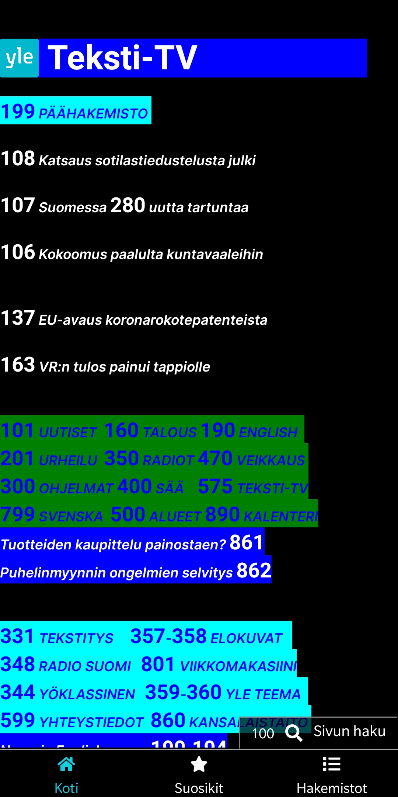

# ApiNaattorit Teksti-TV


## Installing project locally

1. To run this project locally, you need to get free API keys from YLE. [More info](https://developer.yle.fi/en/index.html)
2. Make sure Node LTS or greater is installed. [Installation](https://nodejs.org/en/download/)
3. Make sure Expo CLI is installed. [Installation](https://docs.expo.io/get-started/installation/)
4. Clone the repository
   ```
   git clone https://github.com/Joonas16/ApiNaattorit.git
   ```
5. Install NPM packages
   ```sh
   npm install
   ```
6. Create `.env` file and enter your API keys (see example.env)
   ```
   APP_ID=[APP ID HERE]  <-- Don't leave brackets
   APP_KEY=[APP KEY HERE]
   API_URL=https://external.api.yle.fi/v1
   ```
7. Start the project
   ```sh
   npm start
   ```

## If you are running locally on iOS:
For swipe gestures to work properly,
after npm install, comment line 62 in `node_modules/react-native-swipe-gestures/index.js`, :
   ```JS
   gestureIsClick(gestureState) {
     return (
       Math.abs(gestureState.dx) < swipeConfig.gestureIsClickThreshold
       // && Math.abs(gestureState.dy) < swipeConfig.gestureIsClickThreshold
      )
   }
   ```

## Options for local workflow

- Running from local network with Expo Go, see [Google Play](https://play.google.com/store/apps/details?id=host.exp.exponent&hl=fi&gl=US) or [Apple Store](https://apps.apple.com/us/app/expo-go/id982107779)
- Running with Android emulator, [Instructions](https://docs.expo.io/workflow/android-studio-emulator/)
- Running with iOS simulator, [Instructions](https://docs.expo.io/workflow/ios-simulator/)

## Key technologies & libraries

Name | Description | Usage
--- | --- | ---
[Expo](https://docs.expo.io/) | Framework and a platform for universal React applications | Used to bootstrap the project and for development workflow
[axios](https://www.npmjs.com/package/axios) | Promise based HTTP client | Used to fetch teletext data from API
[dotenv](https://www.npmjs.com/package/dotenv) | Module that loads environment variables from .env file | Used for storing API keys locally without committing them to git
[lodash](https://lodash.com/) | JS utility library | Used to filter unique objects of an array
[expo-sqlite](https://docs.expo.io/versions/latest/sdk/sqlite/) | Database that is persistent across restarts | Used to save user favourite pages
[@fortawesome](https://fortawesome.com/) | Library of fonts and icons. | Used for fonts and icons.
[react-navigation](https://reactnavigation.org/) | For routing and navigation between pages. | Used for routing and navigation in bottom tabs.
[react-native-swipe-gestures](https://www.npmjs.com/package/react-native-swipe-gestures) | Component for swipe gestures | Used for swiping to next or previous page.
[react-native-elements](https://reactnativeelements.com/) | Cross Platform React Native UI Toolkit | Provides an all-in-one UI kit for creating apps in react native
[react-native](https://reactnative.dev/) | The best parts of native development with React and a best-in-class JavaScript library | Used to create native apps for Android and iOS using React

## Run with Expo Go
### Scan QR-code with Expo Go-app 


To get this to work on iOS, send your expo user email to joonas.aaltonen16@gmail.com